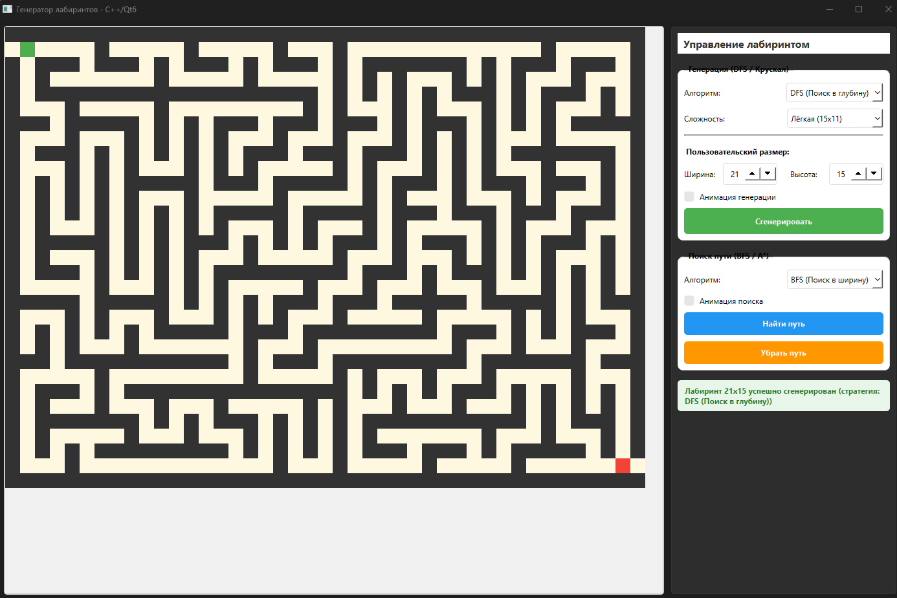
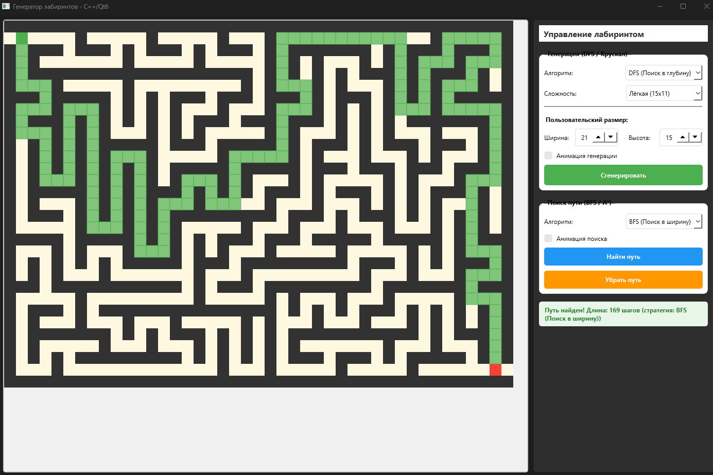

# Генератор лабиринтов и поиск пути

## Суть проекта

**MazeGenerator** — это десктопное приложение для генерации случайных лабиринтов и визуализации алгоритмов поиска пути, разработанное на C++ с использованием фреймворка Qt.

Программа позволяет:

- Генерировать идеальные лабиринты (без циклов и изолированных областей) с использованием алгоритмов **DFS** (поиск в глубину) и **Крускала**
- Выбирать сложность лабиринта: Лёгкая (15×11), Средняя (21×15), Сложная (31×21) или задавать пользовательский размер до 100×100
- Находить кратчайший путь от старта (зелёная клетка) до финиша (красная клетка) с помощью алгоритмов **BFS** (поиск в ширину) и **A*** (Астар)
- Визуализировать процесс генерации и поиска пути с пошаговой анимацией
- Масштабировать лабиринт с помощью колесика мыши

Приложение имеет графический интерфейс, построенный на компонентах **Qt Widgets**, что обеспечивает наглядное отображение структуры лабиринта и работы алгоритмов. Проект демонстрирует применение паттернов проектирования **Стратегия** (для алгоритмов генерации и поиска) и **Наблюдатель** (сигналы и слоты Qt для событий интерфейса и анимации).


## Инструкция по сборке

### Требования

Для успешной сборки проекта необходимо установить следующее ПО:

| Компонент | Версия | Примечание |
|-----------|--------|-------------|
| CMake | 3.19 или выше | [Скачать](https://cmake.org/download/) |
| Qt | 6.11.0 (или 5.15+) | Компоненты: Core, Widgets |
| MinGW | 11.2.0 64-bit | Входит в поставку Qt через Maintenance Tool |
| Компилятор | GCC 11.2.0+ | Должен быть совместим с версией Qt |

### Установка Qt и MinGW

1. Скачайте онлайн-установщик Qt с официального сайта: https://www.qt.io/download
2. При установке выберите компоненты:
   - **Qt 6.11.0** → **MinGW 11.2.0 64-bit**
   - **Developer and Designer Tools** → **MinGW 11.2.0 64-bit**
   - **Developer and Designer Tools** → **CMake** (если не установлен отдельно)
3. После установки пути будут выглядеть так:
   - Qt: `C:/Qt/6.11.0/mingw_64`
   - MinGW: `C:/Qt/Tools/mingw1120_64`

### Установка CMake (если не установлен)

Скачайте установщик с https://cmake.org/download/ и при установке отметьте опцию **«Add CMake to the system PATH»**.

---

### Сборка проекта

#### Через терминал (рекомендуется)

```bash
# Конфигурация CMake с указанием компилятора и пути к Qt
cmake -S . -B build -G "MinGW Makefiles" ^
    -DCMAKE_C_COMPILER="C:/Qt/Tools/mingw1120_64/bin/gcc.exe" ^
    -DCMAKE_CXX_COMPILER="C:/Qt/Tools/mingw1120_64/bin/g++.exe" ^
    -DCMAKE_MAKE_PROGRAM="C:/Qt/Tools/mingw1120_64/bin/mingw32-make.exe" ^
    -DCMAKE_PREFIX_PATH="C:/Qt/6.11.0/mingw_64" -DBUILD_TESTS=ON

# Сборка проекта
cmake --build build

# Запуск приложения
cd build
./MazeGenerator.exe

# Запуск тестов
cd build
ctest --verbose
# Запуск приложения
cd build
./MazeGenerator.exe
```

# Пример запуска


# Визуализация пути решения (можно выбрать анимацию для показа пути)


